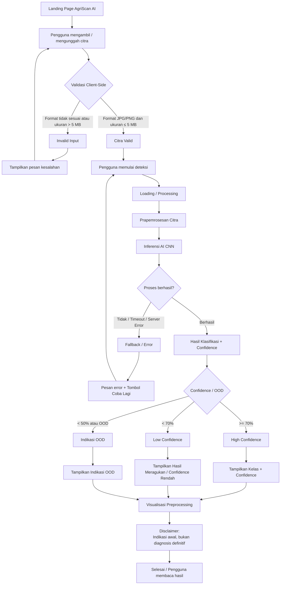

# DRAFT User Flow & Use Case Detail — AgriScan AI

## BAGIAN 1 — USER FLOW

### Perspektif UX & Interaction Analyst

## 1. Langkah Alur Pengguna

Alur utama AgriScan AI dimulai ketika pengguna membuka aplikasi web, memasukkan citra tanaman, kemudian sistem melakukan validasi, pemrosesan AI, dan menyajikan hasil berdasarkan confidence level.

### Alur Utama

| No. | Aktor/Pengguna  | Status Sistem              | Aktivitas & Respons                                                                                                                                |
| --: | --------------- | -------------------------- | -------------------------------------------------------------------------------------------------------------------------------------------------- |
|   1 | Petani/Penyuluh | **Idle/Landing**           | Pengguna membuka web AgriScan AI melalui browser.                                                                                                  |
|   2 | Petani/Penyuluh | **Input**                  | Pengguna memilih mengambil foto melalui kamera atau mengunggah citra tanaman.                                                                      |
|   3 | —               | **Client-Side Validation** | Sistem memeriksa format dan ukuran berkas. Format yang diterima **JPG/PNG**, ukuran maksimal **5 MB**.                                             |
|   4 | —               | **Invalid Input**          | Jika format bukan JPG/PNG atau ukuran >5 MB, sistem menolak input dan menampilkan pesan kesalahan. Pengguna diminta memilih/mengambil citra lain.  |
|   5 | —               | **Input Valid**            | Jika format dan ukuran memenuhi ketentuan, sistem menerima citra dan pengguna dapat memulai deteksi.                                               |
|   6 | Petani/Penyuluh | **Processing/Loading**     | Pengguna menekan aksi deteksi.                                                                                                                     |
|   7 | —               | **Loading/Inference**      | Sistem mengirim citra untuk dianalisis dan melakukan prapemrosesan serta inferensi AI. Target respons maksimal **≤3,0 detik**.                     |
|   8 | —               | **Analysis Result**        | Sistem memperoleh kelas prediksi dan confidence level.                                                                                             |
|  9A | —               | **High Confidence**        | Jika confidence **≥70%**, sistem menampilkan hasil sebagai **indikasi dominan** beserta confidence level.                                          |
|  9B | —               | **Low Confidence**         | Jika confidence **<70%**, sistem menampilkan **"Hasil Meragukan / Confidence Rendah"**.                                                            |
|  9C | —               | **OOD**                    | Jika objek terindikasi berada di luar enam kelas target atau confidence **<50%**, sistem menandai hasil sebagai **indikasi OOD**.                  |
|  10 | —               | **Result Display**         | Sistem menampilkan hasil klasifikasi, confidence (%), dan visualisasi prapemrosesan.                                                               |
|  11 | —               | **Disclaimer**             | Sistem selalu menampilkan: **"Hasil AI merupakan indikasi awal, bukan diagnosis definitif dari pakar."**                                           |
|  12 | Petani/Penyuluh | **Completed**              | Pengguna membaca hasil sebagai bahan pemeriksaan awal.                                                                                             |
|  13 | —               | **Fallback/Error**         | Jika server Flask, proses AI, atau komunikasi mengalami kegagalan/timeout, sistem menampilkan pesan kesalahan yang ramah dan tombol **Coba Lagi**. |

---

## 2. Penanganan Status Sistem

### A. Client-Side Validation

Sebelum citra diproses lebih lanjut, sistem melakukan pemeriksaan:

* **Format:** JPG atau PNG.
* **Ukuran maksimum:** 5 MB.

**Jika valid:**

> Citra diterima → pengguna dapat melanjutkan deteksi.

**Jika tidak valid:**

> Citra ditolak → pesan kesalahan → pengguna memilih/mengambil citra baru.

---

### B. Loading State

Saat AI melakukan analisis, sistem berada pada status **Loading/Processing**.

Indikator proses harus memberikan umpan balik bahwa citra sedang dianalisis.

Target:

> **Waktu respons inferensi AI ≤3,0 detik.**

Loading tidak boleh memberikan kesan bahwa sistem telah selesai sebelum hasil AI tersedia.

---

### C. Conditional Result State

Setelah inferensi selesai, sistem menentukan status berdasarkan confidence.

#### High Confidence

**Confidence ≥70%**

→ Hasil ditampilkan sebagai **indikasi dominan**.

Contoh:

> **Tomat Early Blight**
> Confidence: **87%**
> Status: **Indikasi Dominan**

#### Low Confidence

**Confidence <70%**

→ Sistem menampilkan:

> ⚠️ **Hasil Meragukan / Confidence Rendah**
> Confidence: **63%**

#### OOD

Jika objek terindikasi berada di luar enam kelas target **atau confidence <50%**:

> ⚠️ **Indikasi OOD — Objek di luar kategori target**
> Hasil tidak dapat dipercaya sebagai klasifikasi dari enam kelas target.

**Catatan:** Kondisi confidence <50% secara eksplisit diperlakukan sebagai indikasi OOD sesuai BR-03.

---

### D. Fallback State

Jika terjadi:

* kegagalan server Flask;
* timeout;
* kegagalan proses AI;

sistem masuk ke **Fallback/Error State**.

Contoh pesan:

> **Analisis belum dapat dilakukan.**
> Terjadi kendala saat memproses citra. Silakan coba lagi.

Disediakan aksi:

> **[Coba Lagi]**

Sistem tidak boleh menampilkan hasil klasifikasi seolah-olah analisis berhasil.

---

# 3. Diagram Alur Mermaid



### Catatan aturan pada diagram

Karena **confidence <50% juga memenuhi kondisi <70%**, implementasi perlu memastikan status OOD menjadi kondisi yang lebih spesifik/prioritas daripada sekadar *Low Confidence*. Secara logika bisnis:

```text
Jika OOD terdeteksi → OOD
Else jika confidence < 50% → OOD
Else jika confidence < 70% → Low Confidence
Else → High Confidence
```

Dengan demikian, hasil dengan confidence **45%**, misalnya, tidak hanya diberi label *Confidence Rendah*, tetapi juga ditandai sebagai **indikasi OOD**.

---

# 4. Matriks Traceability User Flow

| Tahap Flow                 | Use Case | User Story   | Requirement/Rule            |
| -------------------------- | -------- | ------------ | --------------------------- |
| Membuka aplikasi           | UC-01    | US-01, US-02 | Pre-kondisi UC-01           |
| Mengambil/mengunggah citra | UC-01    | US-01, US-02 | FR-01                       |
| Validasi JPG/PNG dan ≤5 MB | UC-01    | US-01, US-02 | NFR-08                      |
| Analisis AI                | UC-01    | US-05, US-06 | FR-02, FR-03                |
| Prapemrosesan              | UC-01    | US-14        | FR-06                       |
| Confidence level           | UC-01    | US-09, US-13 | FR-04, NFR-09, BR-01        |
| High confidence ≥70%       | UC-01    | US-13        | BR-01                       |
| Low confidence <70%        | UC-01    | US-10        | BR-02                       |
| OOD / confidence <50%      | UC-01    | US-11        | BR-03                       |
| Hasil klasifikasi          | UC-01    | US-06, US-13 | FR-03, FR-05                |
| Disclaimer                 | UC-01    | US-15, US-16 | FR-10, BR-04                |
| Fallback error             | UC-01    | —            | Kebutuhan operasional UC-01 |

---

# BAGIAN 2 — USE CASE DETAIL & ACCEPTANCE CRITERIA

# 1. Use Case Detail

## UC-01 — Deteksi Dini Penyakit Tanaman Cabai dan Tomat Berbasis Citra

| Elemen             | Detail                                                                                                                                                |
| ------------------ | ----------------------------------------------------------------------------------------------------------------------------------------------------- |
| **ID Use Case**    | UC-01                                                                                                                                                 |
| **Nama Use Case**  | Deteksi Dini Penyakit Tanaman Cabai dan Tomat Berbasis Citra                                                                                          |
| **Aktor Utama**    | Petani / Penyuluh Pertanian Lapangan                                                                                                                  |
| **Tujuan**         | Memperoleh indikasi awal kondisi tanaman cabai/tomat melalui analisis citra berbasis AI                                                               |
| **Pre-kondisi**    | Pengguna mengakses web app AgriScan AI melalui browser smartphone/PC; kamera atau file citra tanaman siap digunakan                                   |
| **Post-kondisi**   | Sistem menampilkan klasifikasi dari 6 kelas target, confidence level (%), visualisasi prapemrosesan, dan penafian bahwa hasil merupakan indikasi awal |
| **Prioritas**      | Must Have                                                                                                                                             |
| **User Stories**   | US-01, US-05, US-06, US-09, US-13, US-14, US-15                                                                                                       |
| **FR terkait**     | FR-01 s.d. FR-06, FR-10                                                                                                                               |
| **NFR terkait**    | NFR-07, NFR-08, NFR-09, NFR-11, NFR-15                                                                                                                |
| **Business Rules** | BR-01, BR-02, BR-03, BR-04                                                                                                                            |

### Enam Kelas Target

1. **Cabai Normal**
2. **Cabai Antraknosa**
3. **Cabai Leaf Curl**
4. **Tomat Normal**
5. **Tomat Early Blight**
6. **Tomat Late Blight**

---

# 1.1 Skenario Utama — Happy Flow

|    No. | Aktor                                                      | Respons Sistem                                                                         |
| -----: | ---------------------------------------------------------- | -------------------------------------------------------------------------------------- |
|  **1** | Petani/Penyuluh membuka AgriScan AI.                       | Sistem menampilkan halaman aplikasi dan fungsi input citra.                            |
|  **2** | Pengguna mengambil foto atau memilih citra dari perangkat. | Sistem menerima citra untuk divalidasi.                                                |
|  **3** | —                                                          | Sistem memeriksa format dan ukuran citra.                                              |
|  **4** | —                                                          | Jika format JPG/PNG dan ukuran ≤5 MB, sistem menyatakan input valid.                   |
|  **5** | Pengguna menjalankan deteksi.                              | Sistem menampilkan status loading.                                                     |
|  **6** | —                                                          | Sistem melakukan prapemrosesan citra.                                                  |
|  **7** | —                                                          | Sistem melakukan analisis menggunakan model AI CNN.                                    |
|  **8** | —                                                          | Sistem menghasilkan klasifikasi dan confidence level.                                  |
|  **9** | —                                                          | Sistem menentukan status hasil berdasarkan confidence/OOD.                             |
| **10** | —                                                          | Sistem menampilkan hasil klasifikasi, confidence level, dan visualisasi prapemrosesan. |
| **11** | —                                                          | Sistem menampilkan disclaimer wajib.                                                   |
| **12** | Pengguna membaca hasil.                                    | Use case selesai.                                                                      |

---

# 1.2 Skenario Alternatif / Eksepsi

### A1 — File Tidak Valid

Jika:

* format bukan JPG/PNG; **atau**
* ukuran file >5 MB,

maka sistem:

1. menolak citra;
2. tidak menjalankan analisis AI;
3. menampilkan pesan kesalahan;
4. meminta pengguna memberikan citra yang sesuai.

---

### A2 — Confidence Rendah

Jika:

> **50% ≤ Confidence <70%**

maka sistem:

1. tetap menampilkan hasil klasifikasi;
2. menampilkan nilai confidence;
3. menampilkan **"Hasil Meragukan / Confidence Rendah"**;
4. tetap menampilkan disclaimer.

---

### A3 — Indikasi OOD

Jika:

> **Confidence <50%** atau fitur citra terindikasi berada di luar enam kelas target,

maka sistem:

1. menandai hasil sebagai **indikasi OOD**;
2. memberi tahu pengguna bahwa objek tidak dapat dipercaya sebagai klasifikasi dari enam kelas target;
3. tidak mengklaim diagnosis definitif;
4. menampilkan disclaimer.

---

### A4 — Server/AI Error

Jika terjadi server error, AI crash, atau timeout:

1. sistem tidak menampilkan hasil prediksi palsu;
2. sistem menampilkan pesan error yang ramah;
3. sistem menyediakan tombol **Coba Lagi**;
4. pengguna dapat mengulangi proses.

---

# 2. Acceptance Criteria

## Skenario 1 — Sukses: Deteksi Tanaman dengan Confidence Tinggi

### AC-01 — Happy Flow

**Given**

* Pengguna berada pada aplikasi AgriScan AI.
* Pengguna memberikan citra tanaman yang valid.
* Citra berformat **JPG atau PNG**.
* Ukuran citra **≤5 MB**.
* Citra dapat diklasifikasikan ke dalam salah satu dari **6 kelas target**.
* Confidence hasil prediksi adalah **≥70%**.

**When**

* Pengguna menjalankan proses deteksi.

**Then**

* Sistem menerima citra.
* Sistem melakukan prapemrosesan.
* Sistem menampilkan visualisasi prapemrosesan.
* Sistem melakukan inferensi AI.
* Hasil inferensi tersedia dalam waktu **≤3,0 detik**.
* Sistem menampilkan **tepat satu dari 6 kelas target**.
* Sistem menampilkan confidence dalam satuan **persen (%)**.
* Confidence yang ditampilkan **≥70%**.
* Hasil diberi status **indikasi dominan**.
* Sistem menampilkan disclaimer:

> **"Hasil AI merupakan indikasi awal, bukan diagnosis definitif dari pakar."**

**Expected Result:** **PASS**

---

## Skenario 2 — Peringatan: Confidence Rendah / OOD

### AC-02 — Confidence Rendah

**Given**

* Pengguna memberikan citra berformat **JPG/PNG** dengan ukuran **≤5 MB**.
* Sistem berhasil melakukan inferensi.
* Confidence hasil prediksi adalah **60%**.

**When**

* Sistem selesai melakukan analisis.

**Then**

* Sistem menampilkan hasil klasifikasi dari salah satu **6 kelas target**.
* Sistem menampilkan confidence **60%**.
* Karena **60% <70%**, sistem menampilkan:

> **"Hasil Meragukan / Confidence Rendah."**

* Sistem tetap menampilkan visualisasi prapemrosesan.
* Sistem menampilkan disclaimer wajib.
* Sistem tidak menyatakan hasil sebagai diagnosis definitif.

**Expected Result:** **PASS**

---

### AC-03 — Indikasi OOD

**Given**

* Pengguna memberikan citra yang dapat diproses.
* Sistem memperoleh confidence **45%**, atau sistem mendeteksi fitur citra berada di luar enam kelas target.

**When**

* Sistem menyelesaikan proses analisis.

**Then**

* Sistem menandai hasil sebagai **indikasi OOD**.
* Sistem menyatakan bahwa hasil tidak dapat dipercaya sebagai klasifikasi dari enam kelas target.
* Sistem tidak memberikan diagnosis definitif.
* Sistem menampilkan disclaimer wajib.

**Expected Result:** **PASS**

> **Catatan:** Confidence **45%** memenuhi dua kondisi, yaitu `<70%` dan `<50%`. Berdasarkan BR-03, kondisi OOD harus diprioritaskan.

---

## Skenario 3 — Gagal: Validasi Input Berkas

### AC-04 — File Lebih dari 5 MB

**Given**

* Pengguna memilih file citra berformat JPG.
* Ukuran file adalah **5,5 MB**.

**When**

* Pengguna mencoba memasukkan citra ke sistem.

**Then**

* Sistem menolak file.
* Sistem tidak menjalankan inferensi AI.
* Sistem menampilkan informasi bahwa ukuran file melebihi batas **5 MB**.
* Pengguna dapat memilih/mengambil citra lain.

**Expected Result:** **PASS**

---

### AC-05 — Format Tidak Didukung

**Given**

* Pengguna memilih file dengan format selain **JPG atau PNG**, misalnya PDF.
* Ukuran file berada di bawah **5 MB**.

**When**

* Pengguna memasukkan file tersebut.

**Then**

* Sistem menolak file.
* Sistem tidak menjalankan inferensi AI.
* Sistem memberi informasi bahwa format yang didukung adalah **JPG/PNG**.
* Pengguna dapat memberikan citra baru.

**Expected Result:** **PASS**

---

# 3. Matriks Acceptance Criteria

| ID        | Skenario           | Parameter Uji                                      | Expected Result                                                  |
| --------- | ------------------ | -------------------------------------------------- | ---------------------------------------------------------------- |
| **AC-01** | Sukses             | JPG/PNG, ≤5 MB, confidence ≥70%, ≤3 detik, 6 kelas | Hasil indikasi dominan + confidence + preprocessing + disclaimer |
| **AC-02** | Confidence rendah  | Confidence 60% (<70%)                              | Hasil meragukan + confidence + disclaimer                        |
| **AC-03** | OOD                | Confidence 45% (<50%) / objek OOD                  | Indikasi OOD + disclaimer                                        |
| **AC-04** | File terlalu besar | JPG, 5,5 MB (>5 MB)                                | File ditolak, AI tidak berjalan                                  |
| **AC-05** | Format invalid     | PDF, <5 MB                                         | File ditolak, AI tidak berjalan                                  |

---

## Kesimpulan QA

**UC-01 dinyatakan memenuhi alur inti** apabila minimal kondisi berikut terpenuhi:

* Input hanya menerima **JPG/PNG ≤5 MB**.
* AI menghasilkan klasifikasi dalam **≤3,0 detik**.
* Hasil normal dibatasi pada **6 kelas target**.
* **Confidence ≥70%** → **Indikasi Dominan**.
* **50% ≤ confidence <70%** → **Hasil Meragukan / Confidence Rendah**.
* **Confidence <50% atau terindikasi OOD** → **Indikasi OOD**.
* **100% hasil analisis** menampilkan disclaimer: **"Hasil AI merupakan indikasi awal, bukan diagnosis definitif dari pakar."**
* Kegagalan server/AI tidak boleh menghasilkan klasifikasi palsu dan harus menyediakan **Coba Lagi**.

Dengan kriteria tersebut, alur UX, perilaku sistem, dan pengujian QA untuk fitur inti AgriScan AI sudah saling terhubung dari **User Story → Use Case → User Flow → Acceptance Criteria**.
